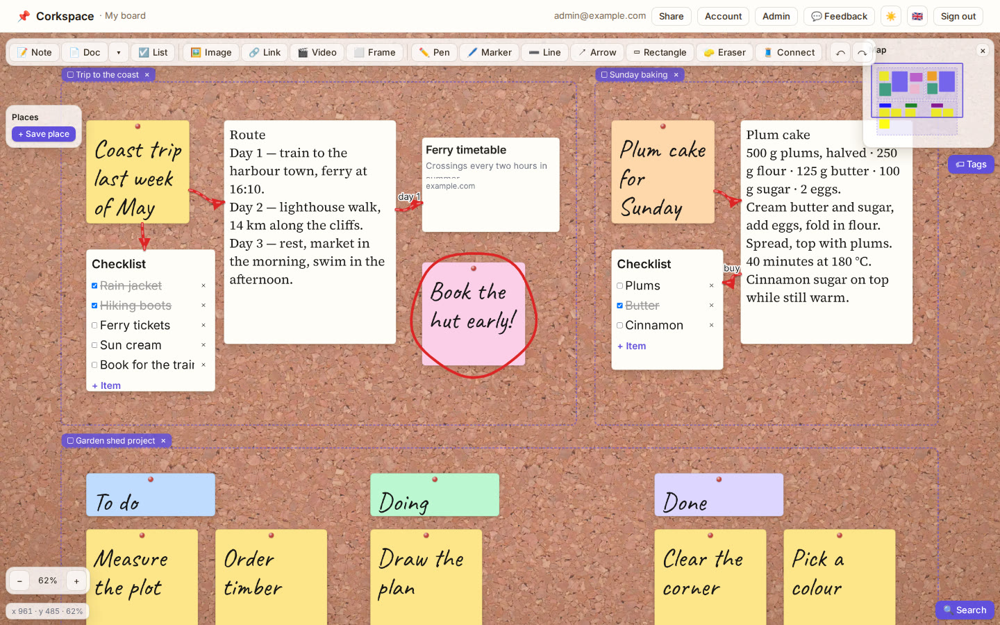
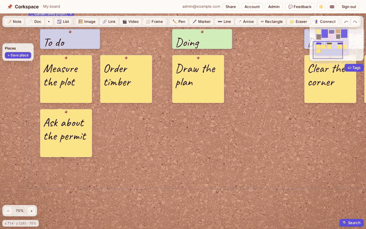
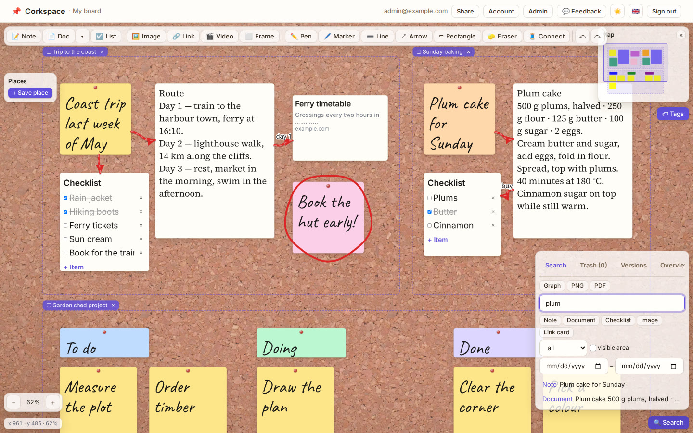
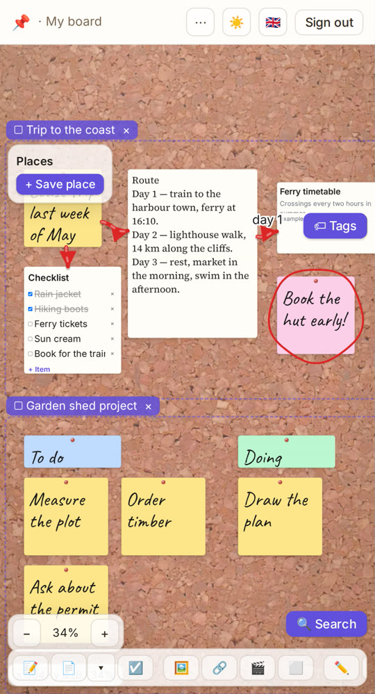
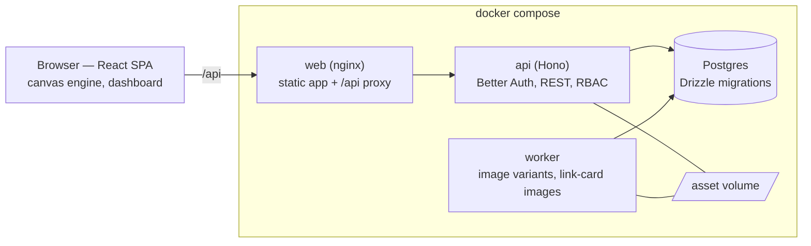

# Corkspace

**An infinite, explorable pinboard you host yourself — sticky notes, rich documents,
checklists, images and link cards on a canvas where everything has a place, tied together
with red threads.**



Corkspace is a Miro-style canvas built from scratch — no canvas SDK — so that it stays smooth
with thousands of items and keeps every item at a real world position you can always find
again. It is a small multi-user product: every account owns a board, owners invite editors
and viewers or share a read-only link, and an admin keeps the instance in order.

## Features

- **A truly infinite board.** Pan, pinch and zoom from 2 % to 800 %; the camera never
  re-renders React, a spatial index culls everything off-screen, and items switch to lighter
  representations as they get small on screen. Minimap, position readout, and the board
  remembers where you were.
- **Entries:** sticky notes in six colours, rich documents (TipTap: headings, lists, quotes,
  code blocks, links, colour and highlight, lined or grid paper), checklists, images (incl. animated GIFs) and link cards
  with previews; YouTube and Vimeo embeds in sandboxed frames.
- **Red threads** between entries with labels and arrowheads, **freehand drawing** (pen,
  marker, lines, arrows, rectangles, eraser) on entries and the board, **frames** that move
  their contents, **teleports** to bookmark places, **tags** with styling rules.
- **Find anything:** a dashboard with full-text search, filters, a connection graph, orphans,
  trash and version history (20 versions per entry) — and a jump-to flight to any result.
- **Sharing:** invite registered users as editors or viewers, or create no-account read
  links. Viewers only ever receive entries marked public — enforced in the database query,
  not in the UI.
- **Comfort:** autosave, undo/redo for every change, light / dark / retro themes, per-board
  appearance (cork, paper, linen or bright backgrounds; fonts; sizes), export of the current
  view as PNG or PDF, and a full touch UI for phones.
- **English and German UI**, English by default.



<table>
<tr>
<td></td>
<td></td>
</tr>
</table>

## Quick start

You need Docker with Compose.

```bash
git clone https://github.com/Juice-de-Orange/corkspace.git && cd corkspace
cp .env.example infra/.env
# edit infra/.env: POSTGRES_PASSWORD, BETTER_AUTH_SECRET (openssl rand -base64 48),
# ADMIN_EMAIL, ADMIN_PASSWORD, and the three URLs (http://localhost:8080 for a local try)
docker compose -f infra/docker-compose.yml --env-file infra/.env up -d --build
```

Open <http://localhost:8080> and sign in with `ADMIN_EMAIL` / `ADMIN_PASSWORD`. There is no
public sign-up: the admin creates accounts under **Admin → Users**.

To see a filled board right away, load the synthetic demo content into your board:

```bash
SEED_URL=http://localhost:8080 SEED_EMAIL=… SEED_PASSWORD=… pnpm db:seed-demo
```

For a server behind a reverse proxy with TLS, backups and upgrades, see
[docs/DEPLOYMENT.md](docs/DEPLOYMENT.md).

## How it is built



```
apps/web         React 19 + Vite + Tailwind (canvas, dashboard, admin)
apps/api         Hono + Better Auth + Drizzle REST API
apps/worker      sharp image variants and background jobs
packages/engine  pure canvas math: coordinates, camera, culling, LOD, collision, routing, flight
packages/db      Drizzle schema + migrations (each with a tested down migration)
packages/shared  domain kernel, Zod DTOs, SSRF-guarded fetching, pure domain logic
infra            docker-compose, Dockerfiles, nginx
```

The decisions behind the canvas engine, the data model and the security rules are in
[docs/DESIGN.md](docs/DESIGN.md) and the [architecture decision records](docs/adr/).

## Development

Node ≥ 22 and pnpm 11 (`corepack enable`). Integration and end-to-end tests start Postgres in
Docker through testcontainers.

```bash
pnpm install
pnpm --filter @corkspace/api dev   # API with reload (needs a Postgres in DATABASE_URL)
pnpm --filter @corkspace/web dev   # web app on Vite, proxies /api
pnpm verify              # focused-test guard, biome, knip, typecheck, unit, integration, build
pnpm verify:full         # verify + security audit + e2e (Playwright, desktop + mobile) + perf
```

The test layers, coverage gates (engine/shared ≥ 90 %, api ≥ 85 %) and conventions are described
in [docs/TESTING.md](docs/TESTING.md). Contributions are welcome — start with
[CONTRIBUTING.md](CONTRIBUTING.md).

## Status

Built in June and July 2026 and in use on a small self-hosted instance since. The feature set
above is complete and covered by the test suites; open ideas and known rough edges are in the
[issues](https://github.com/Juice-de-Orange/corkspace/issues).

## Built with Claude Code

Corkspace was built by [Claude Code](https://claude.com/claude-code) working through a phased
plan with hard quality gates (tests, coverage, audits) — the working method is described in
[CLAUDE.md](CLAUDE.md). Product decisions, reviews and acceptance were human.

## License

[MIT](LICENSE) © 2026 Max Oberrauch. Third-party assets: see [THIRD_PARTY.md](THIRD_PARTY.md).
